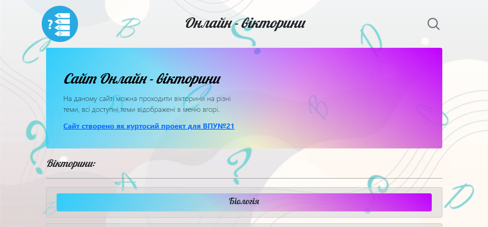
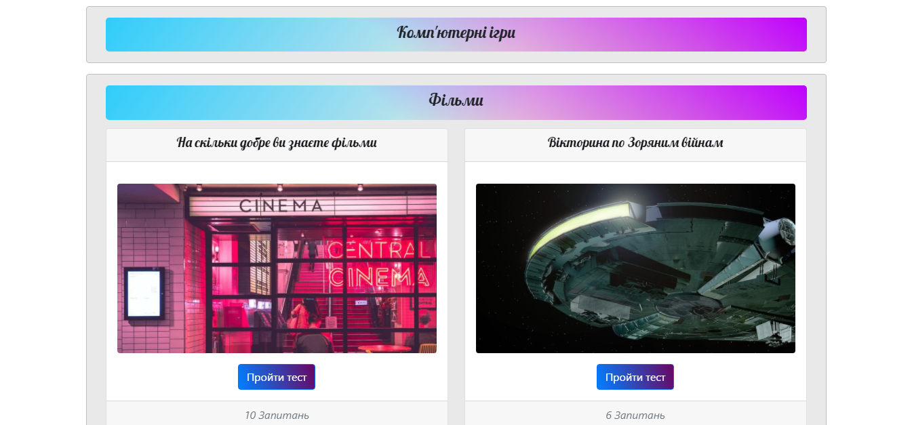
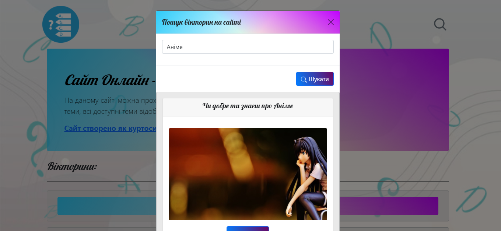
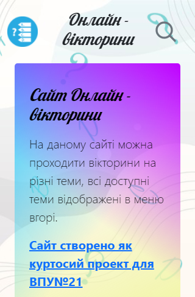
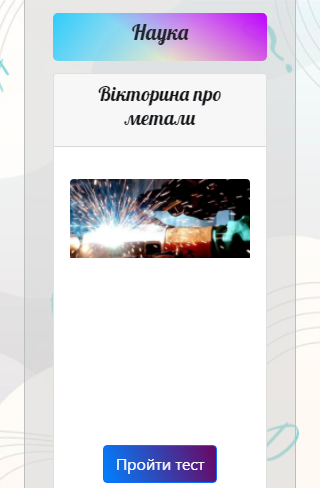
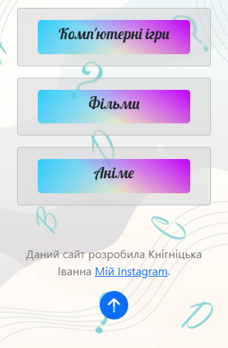
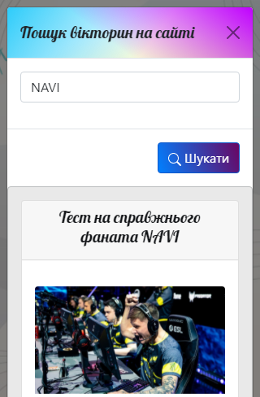

<p align="center"></p>
<h1 align="center">Онлайн - вікторини</h1>

## Description
<b>EN:</b>

This is a course project that I was ordered.

A site (game) for passing quizzes on various topics. Without the use of **API**, only the interface and the functional part of the game.

<b>UA:</b>

Це курсовий проект який в мене заказали.

Сайт (гра) для проходження вікторін на різні теми. Без використання **API** поки лише інтерфейс, та функціональна частина гри.

#
## Screenshots
<p>
  
  
  
  
  
  
  
  
</p>

#
## Technologies used
<b>EN:</b>
- Using [**Bootstrap**](https://getbootstrap.com) (front-end framework)
- Data storage in files in **JSON** format (without using the **API**)
- Using the library [**jQuery**](https://jquery.com)
- Creating a **JavaScript** quiz game
- Using the ***Cookie*** system
- Information search and easy site navigation

<b>UA:</b>
- Використання [**Bootstrap**](https://getbootstrap.com) (front-end framework)
- Зберігання даних у файлах у форматі **JSON** (без використання **API**)
- Використання бібліотеки [**jQuery**](https://jquery.com)
- Створення гри-вікторини на **JavaScript**
- Використання системи ***Cookie***
- Пошук інформації та зручна навігація по сайту

#
## License
```
© 2022, CoolOtaku (ericspz531@gmail.com)
```
